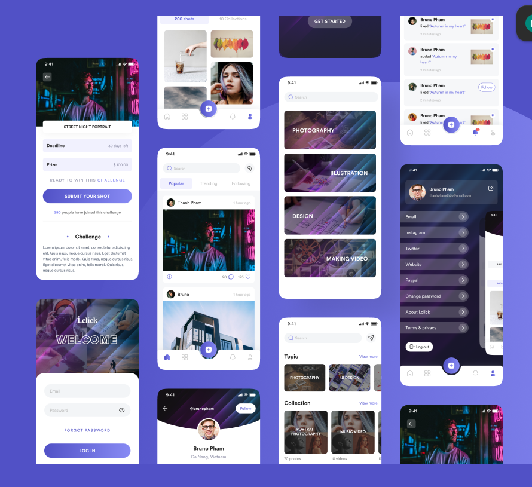
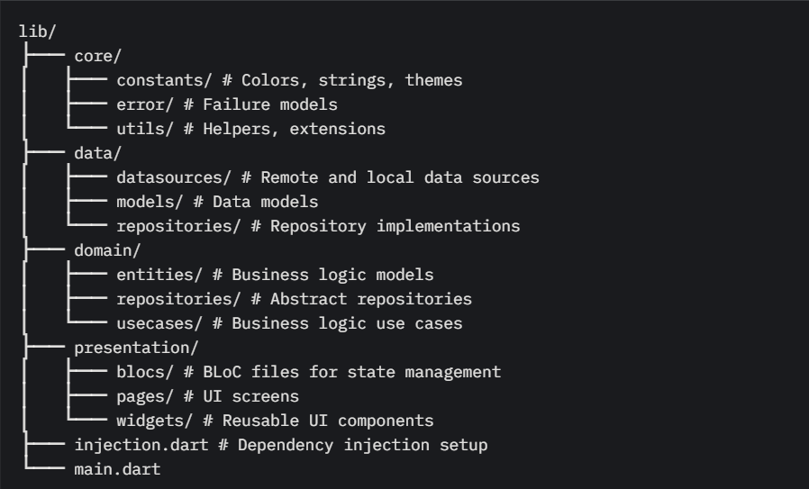
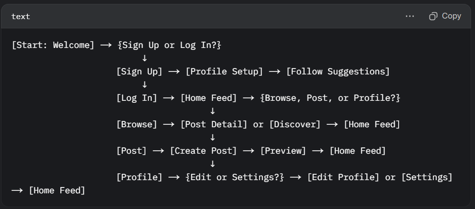

# VibeLink – Connect Through Good Vibes 🌟



VibeLink is a modern Flutter-based social networking app that connects users through shared moods, interests, and moments. Whether you're sharing your daily vibe or finding like-minded people, VibeLink makes it easy and fun!

Built using **Flutter**, this cross-platform app works seamlessly on both iOS and Android.

---

## App Structure



---

## User Flow



## 🔧 Features

✅ Profile creation  
✅ Story sharing  
✅ Feed & post interaction  
✅ Group/community discovery  
✅ Real-time engagement (likes, comments)  
✅ Dark/Light mode support

---

## 🎨 UI Design

The UI is inspired by sleek, community-focused design principles. It uses soft colors, smooth animations, and intuitive navigation to create an inviting user experience.

UI Kit Source: [Figma - Social App UI Kit](https://www.figma.com/design/RptfnnQ1f6nFrvzd1G300w/Social-App---Free-UI-Kit-%F0%9F%93%B1--Community-?node-id=16-1837&p=f&t=NWI5GHXrNhkSES0A-0)

---

## 🚀 Getting Started

### Prerequisites

- Flutter SDK installed
- Android Studio / Xcode (for mobile builds)
- Git

### Installation

1. Clone the repo:
   ```bash
   git clone https://github.com/yourusername/vibelink.git
   ```
